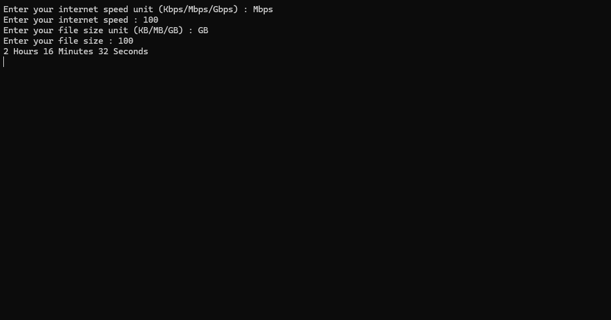

#ByteETA - Download Time Calculator

This is my first C# project! It calculates how long it would take to download a file based on your internet speed.

## 📸 ScreenShot

## 📌 v1.0 Release Notes
Initial release with basic download time calculation.

## 💡 Note  
Since this is my first C# project, there may be some bugs or things that could be improved.  
Feel free to share any feedback or suggestions!

## 📜 License  
This project is licensed under the MIT License.  
For more details, see the [LICENSE](LICENSE) file.
